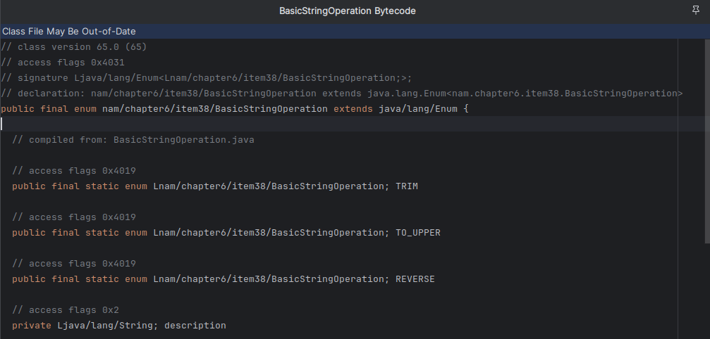

# item38 - 확장 가능한 enum 이 필요하다면 interface 를 이용하라

> 참고 자료
> Baeldung > [Extending Enums in Java](https://www.baeldung.com/java-extending-enums)
> Baeldung > [Sample Code](https://github.com/eugenp/tutorials/tree/master/core-java-modules/core-java-lang-oop-types/src/main/java/com/baeldung/enums/extendenum)
## Enum 은 상속 할 수 없다.

자바 5 에 추가된 Enum 은 기본적으로 final 클래스 이기 때문에 다른 클래스를 상속 할 수 없다.


## Enum 을 상속 하고 싶다.

BasicStringOperation 을 통해 String 에 적용 할 수 있는 기본 연산을 TypeSafe 하게 정의 하였다.

```java
public enum BasicStringOperation {
    TRIM("Removing leading and trailing spaces."),
    TO_UPPER("Changing all characters into upper case."),
    REVERSE("Reversing the given string.");

    private String description;

    // constructor and getter
}
```

기능을 확장하여 Encoding 과 관련된 String 연산을 추가적으로 정의 하였다.

```java
public enum ExtendedStringOperation extends BasicStringOperation {
    MD5_ENCODE("Encoding the given string using the MD5 algorithm."),
    BASE64_ENCODE("Encoding the given string using the BASE64 algorithm.");

    private String description;

    // constructor and getter
}
```

하지만 이를 compile 하려 하면 compile 에러가 발생한다.

```
Cannot inherit from enum BasicStringOperation
```

### 왜?

enum 을 compile 하면 compiler 는 아래 두가지 magic 을 수행한다.

- enum 을 java.lang.Enum 을 확장한 class 로 바꾼다.
- enum 과 enum 의 상수를에 final 키워드를 추가한다.



## Interface 를 통해 Enum 의 상속을 흉내내자.

### field 접근 기능의 상속

```java
public interface StringOperation {
    String getDescription();
}

public enum BasicStringOperation implements StringOperation {
    TRIM("Removing leading and trailing spaces."),
    TO_UPPER("Changing all characters into upper case."),
    REVERSE("Reversing the given string.");

    private String description;
    // constructor and getter override
}

public enum ExtendedStringOperation implements StringOperation {
    MD5_ENCODE("Encoding the given string using the MD5 algorithm."),
    BASE64_ENCODE("Encoding the given string using the BASE64 algorithm.");

    private String description;

    // constructor and getter override
}
```

### Operation 을 포함하여 확장하기

```java
public interface StringOperation {
    String getDescription();

    String apply(String input);
}

public enum BasicStringOperation implements StringOperation {
    TRIM("Removing leading and trailing spaces.") {
        @Override
        public String apply(String input) {
            return input.trim();
        }
    },
    TO_UPPER("Changing all characters into upper case.") {
        @Override
        public String apply(String input) {
            return input.toUpperCase();
        }
    },
    REVERSE("Reversing the given string.") {
        @Override
        public String apply(String input) {
            return new StringBuilder(input).reverse().toString();
        }
    };

    //...
}

public enum ExtendedStringOperation implements StringOperation {
    MD5_ENCODE("Encoding the given string using the MD5 algorithm.") {
        @Override
        public String apply(String input) {
            return DigestUtils.md5Hex(input);
        }
    },
    BASE64_ENCODE("Encoding the given string using the BASE64 algorithm.") {
        @Override
        public String apply(String input) {
            return new String(new Base64().encode(input.getBytes()));
        }
    };


    private String description;

    ExtendedStringOperation(String description) {
        this.description = description;
    }

    @Override
    public String getDescription() {
        return description;
    }
}
```

위 코드에서 상당히 독특한 문법이 활용되었다. 
확장한 인터페이스의 두 메서드 중 `getDescription` 는 생성자를 통해 필드로 정의한 값을 공통적인 로직으로 처리 하고
부족한 `apply` 메서드는 Enum 상수를 정의 하면서 바로 익명 클래스를 통해 각각 정의 하였다.

개인적으로 위와 같은 요구 사항이 있다면 익명클래스가 아닌 함수를 필드로 정의해 활용 할 것 같다.

```java
public enum BasicStringOperation implements StringOperation {
        TRIM("Removing leading and trailing spaces.", String::trim),
        TO_UPPER("Changing all characters into upper case.", String::toUpperCase),
        REVERSE("Reversing the given string.", input -> new StringBuilder(input).reverse().toString());

        private String description;
        private Function<String, String> operation;

        BasicStringOperation(String description, Function<String, String> operation) {
            this.description = description;
            this.operation = operation;
        }

        @Override
        public String getDescription() {
            return description;
        }

        @Override
        public String apply(String input) {
            return operation.apply(input);
        }
    }
```

### Enum 확장 흉내의 한계점

지금껏 Interface 를 이용해 확장을 흉내 내었지만 getDescription, apply 메서드의 구현을 생각해보면 모든
StringOperation 의 하위 타입에서 같은 것이란 을 예상 할 수 있다. 즉, 중복 코드가 발생 할 것이다.

enum 의 abstract class, class 에 대한 확장은 지원 되지 않으므로 이는 어쩔수 없다고 한다.
이를 해결 하기 위해 lombok 등의 동적 코드 생성이나, 해당 기능을 위한 (static)helper class 를 활용 할 수 있다.

## Enum 의 코드에 손을 댈 수 없는 상황에서 EnumMap 을 통해 기능의 확장을 흉내내자.

